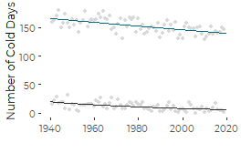
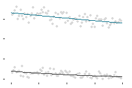
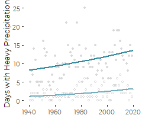
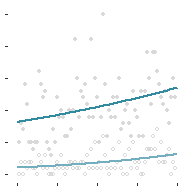

Revised Graphcs for Weather Events
================
Curtis C. Bohlen, Casco Bay Estuary Partnership.
02/01/2021

-   [Install Libraries](#install-libraries)
-   [Temperature Exeedences](#temperature-exeedences)
    -   [Read Data](#read-data)
    -   [Poisson Models](#poisson-models)
    -   [Plotting](#plotting)
        -   [Basic Graphic](#basic-graphic)
        -   [Graphic With No Labels](#graphic-with-no-labels)
-   [Precipitation Frequencies](#precipitation-frequencies)
    -   [Load Data](#load-data)
    -   [Poisson Models](#poisson-models-1)
    -   [Plotting](#plotting-1)
        -   [Basic Graphic](#basic-graphic-1)
        -   [Graphic With No Labels](#graphic-with-no-labels-1)


# Install Libraries

``` r
library(tidyverse)
#> -- Attaching packages --------------------------------------- tidyverse 1.3.0 --
#> v ggplot2 3.3.3     v purrr   0.3.4
#> v tibble  3.0.5     v dplyr   1.0.3
#> v tidyr   1.1.2     v stringr 1.4.0
#> v readr   1.4.0     v forcats 0.5.0
#> -- Conflicts ------------------------------------------ tidyverse_conflicts() --
#> x dplyr::filter() masks stats::filter()
#> x dplyr::lag()    masks stats::lag()
library(readr)

library(CBEPgraphics)
load_cbep_fonts()
theme_set(theme_cbep())
```

# Temperature Exeedences

## Read Data

The Annual Data Downloaded from NOAA’s Climate Data Online includes
counts of the number of days exceeding various temperature thresholds,
as follows:

-   DX90: Number of days with maximum temperature &gt;= 32.2°C/90°F.  
-   DX70: Number of days with maximum temperature &gt;= 21.1°C/70°F.  
-   DX32: Number of days with maximum temperature &lt;= 0°C/32°F.  
-   DT32: Number of days with minimum temperature &lt;= 0°C/32°F.  
-   DT00: Number of days with minimum temperature &lt;= -17.8°C/0°F.

``` r
sibfldnm <- 'Original_Data'
parent <- dirname(getwd())
sibling <- paste(parent,sibfldnm, sep = '/')
fn <- 'longannualdata.csv'

longannualdata <- read_csv(paste(sibling,fn, sep = '/')) %>%
  select(-station) %>%
  mutate(year = as.numeric(format(date, format='%Y'))) %>%
  mutate(cyear = year-1980)
#> 
#> -- Column specification --------------------------------------------------------
#> cols(
#>   date = col_datetime(format = ""),
#>   datatype = col_character(),
#>   value = col_double(),
#>   attributes = col_character(),
#>   station = col_character()
#> )
```

We focus on days that got over over 90 Fahrenheit, days that dropped
below 32, and days that got as low as 0 degrees F. Notice that even
though the CDO data was downloaded in metric units, these cumulative
counts are based on English units.

``` r
textdatalong <- longannualdata %>%
  filter(datatype %in% c('DT32', 'DT00'))

textdata <- longannualdata %>%
  filter(datatype %in% c('DT32', 'DT00')) %>%
  pivot_wider(names_from = datatype, values_from = value)
```

## Poisson Models

Note that while we prefer the quasi-Poisson models for inference, the
predictions of the the Poisson models are identical. They differ only in
dispersion. For plotting purposes, since we don’t show model dispersion
on the plots, the two are functionally identical.

``` r
lt32GLM <- glm(DT32 ~ year, family = poisson, data = textdata)
lt00GLM <- glm(DT00 ~ year, family = poisson, data = textdata)
```

``` r
lines <- tibble(yr = seq(1940,2020),
                lt32 = exp(coef(lt32GLM)[1] + 
                             coef(lt32GLM)[2]  * 
                             seq(1940,2020) ),
                lt00 = exp(coef(lt00GLM)[1] + 
                             coef(lt00GLM)[2]  *
                             seq(1940,2020) ),
                 )
```

## Plotting

### Basic Graphic

``` r
plt <- ggplot(textdatalong, aes(x=year))+
  geom_point(aes(y=value), color='grey85', size = 1) +
  geom_line(data = lines, aes(x=yr, y=lt32), lty=1, color=cbep_colors()[1]) +
  geom_line(data = lines, aes(x=yr, y=lt00), lty=1, color=cbep_colors()[3]) +

  theme_cbep(base_size = 9) +
  
  theme(legend.position= 'none') +
  xlab('') +
  ylab("Number of Cold Days")

plt
```



``` r
ggsave('frequencycolddots.pdf',
       device=cairo_pdf, width = 2.75, height = 1.75)
```

### Graphic With No Labels

``` r
plt <- ggplot(textdatalong, aes(x=year))+
  geom_point(aes(y=value), color='grey85', size = 1) +
  geom_line(data = lines, aes(x=yr, y=lt32), lty=1, color=cbep_colors()[1]) +
  geom_line(data = lines, aes(x=yr, y=lt00), lty=1, color=cbep_colors()[3]) +

  theme_cbep(base_size = 9) +
  
  theme(legend.position= 'none',
        axis.text = element_blank(),
        axis.title = element_blank()) +
  xlab('') +
  ylab('')

plt
```



``` r
ggsave('frequencycolddots_bare.pdf',
       device=cairo_pdf, width = 2.25, height = 1.5)
```

# Precipitation Frequencies

1.  DP01: Number of days with &gt;= 0.01 inch/0.254 millimeter in the
    month (year).
2.  DP10: Number of days with &gt;= 0.1 inch/2.54 millimeter in the
    month (year).
3.  DP1X: Number of days with &gt;= 1.0 inch (25.4mm) precipitation in
    the month (year). 9.DSNW: Number of days with snowfall &gt;= 1 inch
    (25 mm). 10.DSND: Number of days with snow depth &gt;= 1 inch (25
    mm).

Note this does not include the number of days with more than two inches
of rain, which is arguably a better metric of intense storms than the
one inch rain threshold. That needs to be derived from the daily data,
as we do here.

## Load Data

``` r
pextdata <- longannualdata %>%
  filter(datatype %in% c('DP1X')) %>%
  select(-attributes) %>%
  pivot_wider(names_from = datatype, values_from = value)
```

``` r
# Days with two inches of rain or more
sibfldnm <- 'Original_Data'
parent <- dirname(getwd())
sibling <- paste(parent,sibfldnm, sep = '/')
fn <- 'longdailydata.csv'

num2inch <- 
  # Read daily data
  read_csv(paste(sibling,fn, sep = '/')) %>%
  select(-station) %>%
  mutate(year = as.numeric(format(date, format='%Y')))  %>%
  select(date,year, datatype, value) %>%
  
  # Filter down to only precipitation data
  filter(datatype=='PRCP') %>%
  rename(PRCP = value) %>%
  filter( ! is.na(PRCP)) %>%
  
  # Convert to inches. Original data in tenths of mm
  mutate(PRCP_IN = PRCP * 0.0393700787 / 10) %>% 
  filter(year > 1940) %>%   # 1940 is an incomplete year in the daily data
  
  # And count the number of high rain events
  filter(PRCP_IN >= 2) %>%  # Only days with two inches of rain or more
  group_by(year) %>%
  summarise(COUNT = n())    # use all caps because "count" is a builtin function
#> 
#> -- Column specification --------------------------------------------------------
#> cols(
#>   date = col_datetime(format = ""),
#>   datatype = col_character(),
#>   value = col_double(),
#>   attributes = col_character(),
#>   station = col_character()
#> )
```

So far, this will be wrong for years that have no large storms, since
the Year will get dropped. We want years with zero intense storms to be
included in the data with a value of zero. We can fix that using a
left\_join.

``` r
pextdata <- left_join(pextdata, num2inch, by='year') %>%
  mutate(COUNT=replace_na(COUNT,0)) %>%
  rename(DP2X = COUNT) %>%
  mutate(cyear = year-1980)

pextdatalong <- pextdata %>%
  gather(key='datatype', value = 'value', -date, -year, -cyear)

rm(sibfldnm, parent, sibling, fn, num2inch)
```

## Poisson Models

``` r
gt1GLM <- glm(DP1X ~ year, family = poisson, data = pextdata)
gt2GLM <- glm(DP2X ~ year, family = poisson, data = pextdata)
```

``` r
lines <- tibble(yr = seq(1940,2020),
                gt1 = exp(coef(gt1GLM)[1] + 
                             coef(gt1GLM)[2]  * 
                             seq(1940,2020) ),
                gt2 = exp(coef(gt2GLM)[1] + 
                             coef(gt2GLM)[2]  *
                             seq(1940,2020) ),
                 )
```

## Plotting

### Basic Graphic

``` r
plt <- pextdatalong %>%
  filter(datatype %in% c('DP1X', 'DP2X')) %>%
  
  ggplot(aes(x=year)) +
  geom_point(aes(y=value, shape = datatype),color='grey85', size = 1) +
  
  geom_line(data = lines, aes(x=yr, y=gt1), 
            lty=1, lwd = 1, color=cbep_colors()[5]) +
  geom_line(data = lines, aes(x=yr, y=gt2), 
            lty=1, lwd = 1, color=cbep_colors()[6]) +
  
  ylab("Days with Heavy Precipitation") +
  xlab('') +
  
  scale_shape_manual(values = c(16, 1)) +
  
  theme_cbep(base_size = 9) +
  theme(legend.position = 'none')
plt
```



``` r
ggsave('highrainfalldots.pdf',
      device=cairo_pdf, width = 2, height = 2)
```

### Graphic With No Labels

``` r
plt <- pextdatalong %>%
  filter(datatype %in% c('DP1X', 'DP2X')) %>%
  
  ggplot(aes(x=year)) +
  geom_point(aes(y=value, shape = datatype),color='grey85', size = 1) +
  
  geom_line(data = lines, aes(x=yr, y=gt1), 
            lty=1, lwd = 1, color=cbep_colors()[5]) +
  geom_line(data = lines, aes(x=yr, y=gt2), 
            lty=1, lwd = 1, color=cbep_colors()[6]) +
  
  scale_shape_manual(values = c(16, 1)) +
  
  theme_cbep(base_size = 9) +
  theme(legend.position= 'none',
        axis.text = element_blank(),
        axis.title = element_blank()) +
  xlab('') +
  ylab('')

plt
```



``` r
ggsave('highrainfalldots_bare.pdf',
      device=cairo_pdf, width = 2, height = 2)
```
