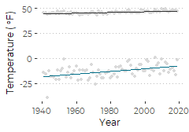
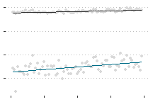
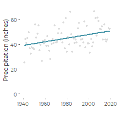
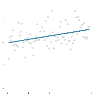

Revised Graphics of Portland Jetport Historical Weather Data
================
Curtis C. Bohlen, Casco Bay Estuary Partnership.
02/01/2021

-   [Introduction](#introduction)
-   [Install Libraries](#install-libraries)
-   [Load Data](#load-data)
-   [Annual Minimum and Average
    Temperature](#annual-minimum-and-average-temperature)
    -   [Create Labels](#create-labels)
    -   [Temperature Exceedences Plot](#temperature-exceedences-plot)
        -   [Basic Plot](#basic-plot)
        -   [Plot With No Labels](#plot-with-no-labels)
-   [Precipitation Totals](#precipitation-totals)
    -   [Read Data and Transform to English
        Units.](#read-data-and-transform-to-english-units.)
    -   [Precipitation Plot](#precipitation-plot)
        -   [Basic Plot](#basic-plot-1)
        -   [Plot with no Labels](#plot-with-no-labels-1)


# Introduction

This is a revision to draft R Notebooks preparing earlier versions of
graphics. It includes only code used in the last round of design and
redesign decisions. A more complete collection of draft graphics are in
“max, min and averages.Rmd”

# Install Libraries

``` r
library(tidyverse)
#> -- Attaching packages --------------------------------------- tidyverse 1.3.0 --
#> v ggplot2 3.3.3     v purrr   0.3.4
#> v tibble  3.0.5     v dplyr   1.0.3
#> v tidyr   1.1.2     v stringr 1.4.0
#> v readr   1.4.0     v forcats 0.5.0
#> -- Conflicts ------------------------------------------ tidyverse_conflicts() --
#> x dplyr::filter() masks stats::filter()
#> x dplyr::lag()    masks stats::lag()
library(readr)

library(CBEPgraphics)
load_cbep_fonts()
theme_set(theme_cbep())
```

# Load Data

``` r
sibfldnm <- 'Original_Data'
parent <- dirname(getwd())
sibling <- file.path(parent,sibfldnm)
fn <- 'longannualdata.csv'

longannualdata <- read_csv(file.path(sibling, fn)) %>%
  select(-station) %>%
  mutate(year = as.numeric(format(date, format = '%Y'))) %>%
  mutate(cyear = year - 1980)
#> 
#> -- Column specification --------------------------------------------------------
#> cols(
#>   date = col_datetime(format = ""),
#>   datatype = col_character(),
#>   value = col_double(),
#>   attributes = col_character(),
#>   station = col_character()
#> )
```

# Annual Minimum and Average Temperature

Codes for key temperature records in the downloaded annual data are:
TAVG – Annual Average Temperature (unweighted; effectively average of
monthly averages, of daily maxes and mins. Note that this means this is
not independent of the other two metrics.) EMXT – Extreme Maximum Annual
Temperature EMNT – Extreme Minimum Temperature

``` r
tdata <- longannualdata %>%
  filter(datatype %in% c('TAVG', 'EMNT')) %>%
  mutate(value = value*(9/5)+32) %>%
  mutate(datatype = factor(datatype, levels = c('TAVG', 'EMNT' )))
```

``` r
tdata.centered <- longannualdata %>%
  filter(datatype %in% c('TAVG', 'EMNT')) %>%
  mutate(value = value*(9/5)+32) %>%
  select(-attributes) %>%
  pivot_wider(names_from = datatype, values_from = value) %>%
  mutate_at(c('TAVG', 'EMNT'), ~ scale(., scale = FALSE)) %>%
  pivot_longer(c( -date, -year, -cyear), names_to = 'datatype', values_to = 'value') %>%
  mutate(datatype = factor(datatype, levels = c('EMXT', 'TAVG', 'EMNT' ))) 

tdata.centered.wide <- tdata.centered %>%
  spread(key = datatype, value = value)

mean.lm.2 <- lm(TAVG ~ cyear, data = tdata.centered.wide)
min.lm.2  <- lm(EMNT ~ cyear, data = tdata.centered.wide)
```

## Create Labels

Note the way we assemble a mathematical expression to be interpreted by
“plotmath” for the annotations. The key idea is that you need to link
each symbol or word either with “\~” if you want a space, or "\*" if you
don’t.

``` r
labs <-  tibble(datatype = c("TAVG", "EMNT"),
              ypos1 = c(55, 10),
              xpos = c(2000, 2000),
              txt = c( paste(round(mean.lm.2$coef[2]*10,2), '~degree*F', "~per~decade"),
                       paste(round(min.lm.2$coef[2]*10,2), '~degree*F', "~per~decade")) ) %>%
  mutate(datatype = factor(datatype, levels = c('TAVG', 'EMNT' ))) 
```

## Temperature Exceedences Plot

### Basic Plot

``` r
plt <- ggplot(tdata, aes(year, value)) + 
  
  geom_point(color = 'gray85', size = 1) +
  geom_smooth(aes(color=datatype), method = 'lm', 
              formula = y~x, se = FALSE, lwd = 0.5) +
  
  xlab('Year') +
  ylab (expression('Temperature ('*~degree*F*')')) +
  
  scale_color_manual(values = cbep_colors2(),
                     name = 'Annual Values',
                     labels = c('Maximum', 'Average', 'Minimum')) +

  scale_y_continuous(breaks = seq(-25 , 100, 25)) +
 
  theme_cbep(base_size = 9) +
  
  theme(legend.position= 'none') +
  theme(panel.grid.major.y = element_line(size = 0.5, 
                                          color = 'gray', 
                                          linetype = 3)) # +

plt
```



``` r
ggsave('avgmin.pdf', device = cairo_pdf, width = 2.5,height = 1.75)
```

### Plot With No Labels

``` r
plt <- ggplot(tdata, aes(year, value)) + 
  
  geom_point(color = 'gray85', size = 1) +
  geom_smooth(aes(color=datatype), method = 'lm', 
              formula = y~x, se = FALSE, lwd = 0.5) +
  
  xlab('Year') +
  ylab (expression('Temperature ('*~degree*F*')')) +
  
  scale_color_manual(values = cbep_colors2(),
                     name = 'Annual Values',
                     labels = c('Maximum', 'Average', 'Minimum')) +

  scale_y_continuous(breaks = seq(-25 , 100, 25)) +
 
  theme_cbep(base_size = 9) +
  
   theme(legend.position= 'none',
        axis.text = element_blank(),
        axis.title = element_blank()) +
  xlab('') +
  ylab('') +
  
  theme(panel.grid.major.y = element_line(size = 0.5, 
                                          color = 'gray', 
                                          linetype = 3)) 

plt
```



``` r
ggsave('avgmin_bare.pdf', device = cairo_pdf, width = 2.25,height = 1.5)
```

# Precipitation Totals

Codes for key annual PRECIPITATION records in the downloaded data are:
PRCP: Total Monthly (Annual) precipitation. Precipitation totals are
based on daily or multi-day (if daily is missing) precipitation report,
in millimeters to tenths. SNOW: Total Monthly (Annual) Snowfall in
millimeters.

## Read Data and Transform to English Units.

``` r
pdata <- longannualdata %>%
  filter(datatype %in% c('PRCP')) %>%
  mutate(PRCP = value * 0.0394)

precip.lm <- lm(PRCP ~ year, data = pdata)
```

## Precipitation Plot

### Basic Plot

``` r
plt <- ggplot(pdata, aes(year, PRCP)) + 
  geom_point(color = 'gray85', size = 1) +
  geom_smooth(method='lm', se = FALSE, lty = 1, color = cbep_colors()[5]) +
  
  theme_cbep(base_size = 9) +
  
  theme(legend.position= 'none') +
  xlab('') +
  
  ylab('Precipitation (inches)') +
  ylim(0,70)
  
plt
#> `geom_smooth()` using formula 'y ~ x'
```



``` r
ggsave('small_precip.pdf', device = cairo_pdf, width = 2.25, height = 2.25)
#> `geom_smooth()` using formula 'y ~ x'
```

### Plot with no Labels

``` r
plt <- ggplot(pdata, aes(year, PRCP)) + 
  geom_point(color = 'gray85', size = 1) +
  geom_smooth(method='lm', se = FALSE, lty = 1, color = cbep_colors()[5]) +
  
  theme_cbep(base_size = 9) +
  
  theme(legend.position= 'none',
        axis.text = element_blank(),
        axis.title = element_blank()) +
  xlab('') +
  ylab('') +
  ylim(0,70)

plt
#> `geom_smooth()` using formula 'y ~ x'
```



``` r
ggsave('small_precip_bare.pdf', device = cairo_pdf, width = 2.0, height = 2.0)
#> `geom_smooth()` using formula 'y ~ x'
```
